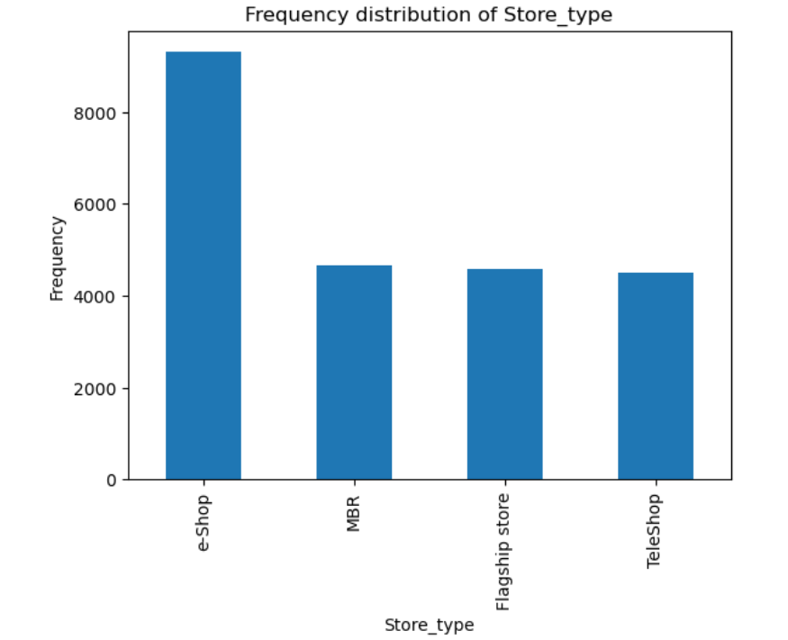
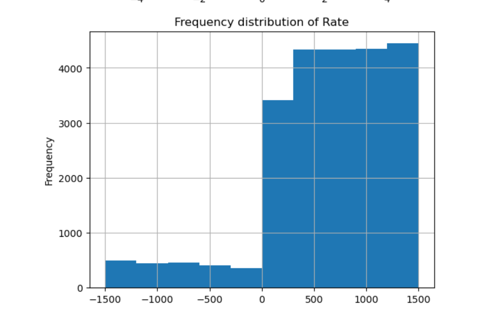
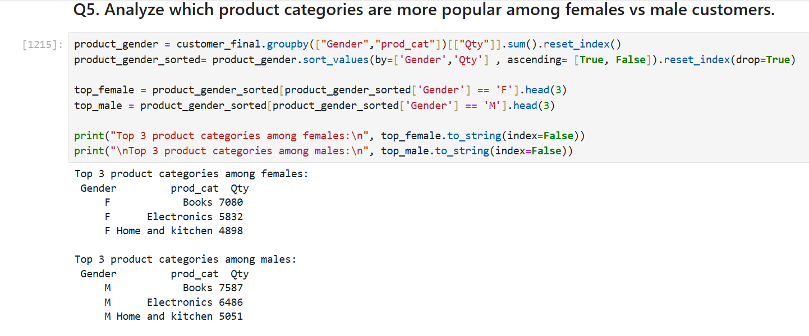
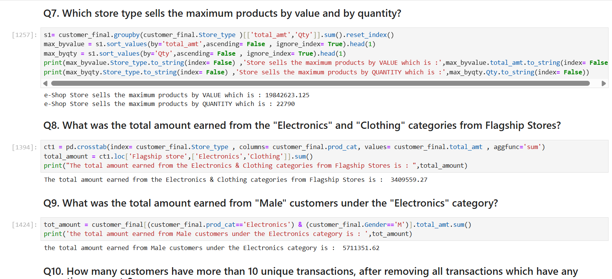

# 🛍️ CustomerRetail Business Analysis – Python Case Study

This project performs in-depth exploratory data analysis (EDA) on retail transaction data to uncover sales patterns, customer behavior, and category performance.

---

## 📌 Objective

- Analyze transactions and customer behavior.
- Track product category trends and customer acquisition.
- Derive business KPIs like revenue, frequency, recency.

---

## 🛠️ Tools Used

- Python (Pandas, Matplotlib, Seaborn)
- Jupyter Notebook

---

## 📂 Project Structure

```
Retail Case Study/
├── Customer.csv
├── prod_cat_info.csv
├── Transactions.csv
├── Retail case study.ipynb

```

---

## 🚀 How to Run

1. Open `Retail case study.ipynb` in Jupyter.
2. Ensure all CSVs are in the same folder.
3. Run all cells to explore insights.

---


## 📸 Screenshot

To include visual proof of your results (e.g., table previews or SQL output), save a screenshot and place it in an `outputs/` folder:









---
🧠 Key Insights
Top revenue categories: Clothing, Electronics

Returning customers contributed over 40% revenue

COD remains the most popular payment method

---

## 📌 Author

**Abhishek Bhardwaj** 

[Linkedin Link](https://www.linkedin.com/in/abhishekbhardwaj28)  |  [GitHub Link](https://github.com/abhishek-9617)
